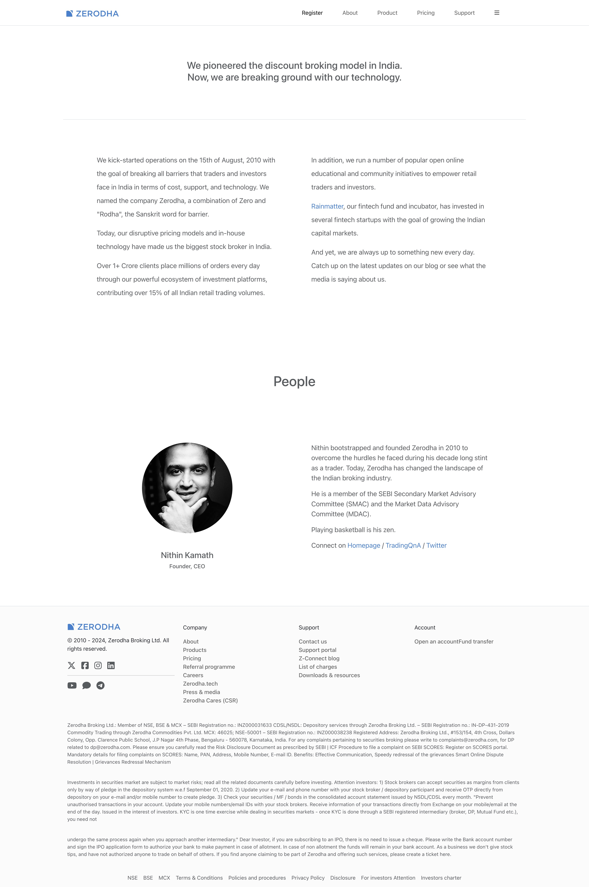

# 🌐 Zerodha Clone

Welcome to **Zerodha Clone**! This repository includes a clone of the popular stock trading platform, built using the MERN stack.

## 🌟 Overview

**Description**: A clone of the popular stock trading platform, Zerodha, built using the MERN stack.

---

## 💻 Technologies

Below is a breakdown of the core technologies used in this project.

| 🌐 Web       |
| ------------ |
| **React.js** |
| **Node.js**  |
| **MongoDB**  |

---

## 📦 Packages / Libraries Used

This project uses the following essential libraries and packages:

| Package / Library  | Purpose                       |
| ------------------ | ----------------------------- |
| `Bootstrap 5.3`    | Responsive design             |
| `Material UI`      | UI Components                 |
| `Express.js`       | Backend framework             |
| `Mongoose`         | MongoDB object modeling       |
| `Bcrypt`           | Password hashing              |
| `Jwt`              | JSON Web Token                |
| `Charts.js`        | Data visualization            |
| `Axios`            | HTTP client                   |
| `React Router Dom` | Client-side routing           |
| `Passport`         | Authentication                |
| `cors`             | Cross-origin resource sharing |
| `Body-Parser`      | Body parsing middleware       |

---
## 🎯 Features

Explore the unique features available in this application:

- **User Authentication**
- **User Authorization**
- **Orders Page**
- **Dashboard**
- **Frontend Clone**

---

## 🔗 Demo & Screenshots

- [Demo](https://zerodha-clone-frontend.vercel.app)
- UserName : Demo
- Password : Demo

| Mock Up                            | Home Page                             | Dashboard                              | About Page                         |
| ---------------------------------- | ------------------------------------- | -------------------------------------- | ---------------------------------- |
|  |  |  |  |

| Products Page                        | Pricing Page                         | Support Page                         |
| ------------------------------------ | ------------------------------------ | ------------------------------------ |
|  |  |  |

---

## 🙏 Acknowledgments

We’d like to thank the following contributors and resources:

- **[Apna College's Delta 3.0 Course](https://www.apnacollege.in/)** - Course resource.

---

### Enjoy exploring and contributing to Zerodha Clone!
